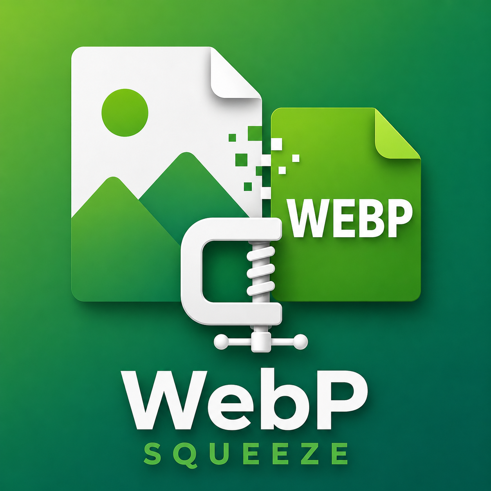

<div align="center">
  
  <h1>WebP Squeeze 🗜️</h1>
  <p><b>Minimalist offline image-to-WebP converter for macOS and Windows.</b><br/>
  CloudConvert-grade compression — the same <code>libwebp</code> codec, but local, free and unlimited.</p>

  
  
  

  <p><b>English</b> · <a href="README.ru.md">Русский</a></p>
</div>

---

## ✨ Features

- **Drag & drop** PNG / JPG / JPEG → WebP (also accepts TIFF / GIF / AVIF)
- **Presets**: Max quality · Balance · Max compression · Lossless + manual slider
- **Batch** — hundreds of files at once
- Shows savings per file and in total
- Saves next to the original or into a folder you pick
- Click a converted file to reveal it in Finder / Explorer
- 100% offline: images never leave your machine, works without internet
- Localized UI (English / Russian) — auto by system language, with a manual RU/EN switch

## 📦 Install

Grab a ready-made installer from the **[Releases](https://github.com/valedol190387/webp-squeeze/releases/latest)** page:

| OS | File |
|----|------|
| **macOS** (Apple Silicon) | `WebP Squeeze-x.x.x-arm64.dmg` |
| **Windows** (x64) | `WebP Squeeze Setup x.x.x.exe` (installer) or `...portable.exe` (no install) |

### macOS — first launch
The app is not signed with an Apple certificate ($99/yr), so macOS will ask for confirmation:
right-click the icon → **Open** → **Open**. Once — after that it launches normally.
If it's still blocked:
```bash
xattr -cr "/Applications/WebP Squeeze.app"
```

### Windows — first launch
SmartScreen may show "Windows protected your PC" → **More info** → **Run anyway** (the app isn't signed with an EV certificate).

## 🛠 Build from source

```bash
pnpm install
pnpm run icon      # generate icons from assets/icon-source.png (once)
pnpm start         # run in development

pnpm run dist      # build for the current OS
pnpm run dist:mac  # macOS only (.dmg)
pnpm run dist:win  # Windows only (.exe) — requires Windows
```

> Cross-building Windows on macOS is not reliably supported (native `sharp` module + NSIS).
> If you fork the repo, installers for both platforms are built automatically:
> push a `vX.Y.Z` tag and the workflow [`.github/workflows/build.yml`](.github/workflows/build.yml)
> builds `.dmg` + `.exe` on GitHub runners and attaches them to the Release.

## 🧩 How it works

- **Electron** — window and packaging into a native app
- **sharp** (libvips + libwebp) — compression engine, `quality` + `effort: 6` + `smartSubsample` (CloudConvert-grade settings)

## 📄 License

[MIT](LICENSE) © Valentin Bryukhantsev
