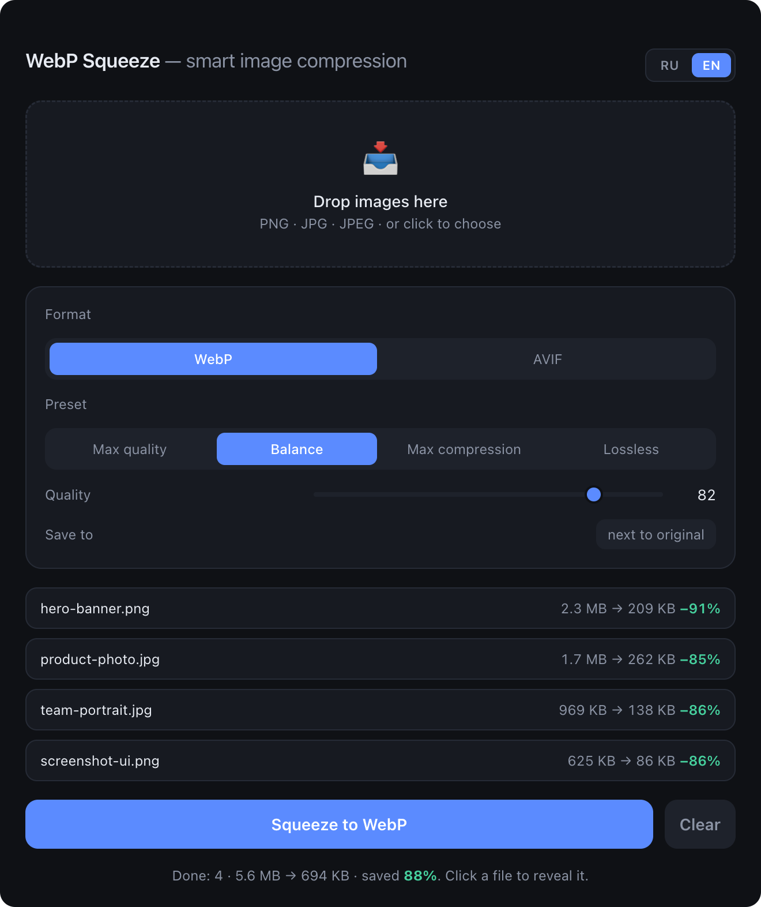

<div align="center">
  
  <h1>WebP Squeeze 🗜️</h1>
  <p><b>Minimalist offline image-to-WebP converter for macOS and Windows.</b><br/>
  CloudConvert-grade compression — the same <code>libwebp</code> codec, but local, free and unlimited.</p>

  
  
  

  <p><b>English</b> · <a href="README.ru.md">Русский</a></p>

  
</div>

---

## ✨ Features

- **Drag & drop** PNG / JPG / JPEG → **WebP or AVIF** (also accepts TIFF / GIF)
- **Presets**: Max quality · Balance · Max compression · Lossless + manual slider
- **Batch** — hundreds of files at once
- Shows savings per file and in total
- Saves next to the original or into a folder you pick
- Click a converted file to reveal it in Finder / Explorer
- 100% offline: images never leave your machine, works without internet
- Localized UI (English / Russian) — auto by system language, with a manual RU/EN switch
- Update notifier — tells you when a newer version is out, one click to the download

## 🤔 Why WebP Squeeze?

There are plenty of WebP tools — here's where this one fits, honestly:

- **vs [Squoosh](https://squoosh.app) (Google):** Squoosh is excellent for tuning **one** image in a browser. WebP Squeeze is built for **batch** — drop dozens of files, get them all next to the originals in one click, fully offline.
- **vs ImageOptim / other GUI apps:** native, minimal, **cross-platform** (macOS *and* Windows), with quality presets and AVIF output.
- **vs `cwebp` / `sharp` CLI:** the same libwebp engine and quality — but no terminal. A real app your non-developer teammates can actually use.

It doesn't try to be an image editor. It does one thing: **bulk, high-quality WebP/AVIF, locally.** WebP is typically ~25–35% smaller than JPEG and 60–90% smaller than PNG at the same visual quality — AVIF often smaller still.

## 📦 Install

Grab a ready-made installer from the **[Releases](https://github.com/valedol190387/webp-squeeze/releases/latest)** page:

| OS | File | Notes |
|----|------|-------|
| **macOS** (Apple Silicon) | `WebP-Squeeze-x.x.x-macOS-arm64.dmg` | Open, drag to Applications |
| **Windows** — Installer | `WebP-Squeeze-x.x.x-Windows-Installer.exe` | Installs the app + creates shortcuts (recommended) |
| **Windows** — Portable | `WebP-Squeeze-x.x.x-Windows-Portable.exe` | Runs without installing — no admin, no shortcuts, USB-friendly |

### ⚠️ macOS — first launch (important)
The app is **not signed with a paid Apple certificate** ($99/yr), so on first launch macOS may say it's **“damaged and can't be opened”** or **“from an unidentified developer”**. The app is fine — this is just Gatekeeper being cautious about unsigned apps.

**How to open:**
1. Drag **WebP Squeeze** into **Applications**.
2. Right-click the app → **Open** → **Open**.

If it still says **“damaged”**, open **Terminal** and run this once, then open normally:
```bash
xattr -cr "/Applications/WebP Squeeze.app"
```
> The DMG also ships a **“READ ME FIRST”** file with these steps, in English and Russian.

### Windows — first launch
SmartScreen may show "Windows protected your PC" → **More info** → **Run anyway** (the app isn't signed with an EV certificate).

## 🛠 Build from source

```bash
pnpm install
pnpm run icon      # generate icons from assets/icon-source.png (once)
pnpm start         # run in development

pnpm run dist      # build for the current OS
pnpm run dist:mac  # macOS only (.dmg)
pnpm run dist:win  # Windows only (.exe) — requires Windows
```

> Cross-building Windows on macOS is not reliably supported (native `sharp` module + NSIS).
> If you fork the repo, installers for both platforms are built automatically:
> push a `vX.Y.Z` tag and the workflow [`.github/workflows/build.yml`](.github/workflows/build.yml)
> builds `.dmg` + `.exe` on GitHub runners and attaches them to the Release.

## 🧩 How it works

- **Electron** — window and packaging into a native app
- **sharp** (libvips + libwebp) — compression engine, `quality` + `effort: 6` + `smartSubsample` (CloudConvert-grade settings)

## 📄 License

[MIT](LICENSE) © Valentin Bryukhantsev
