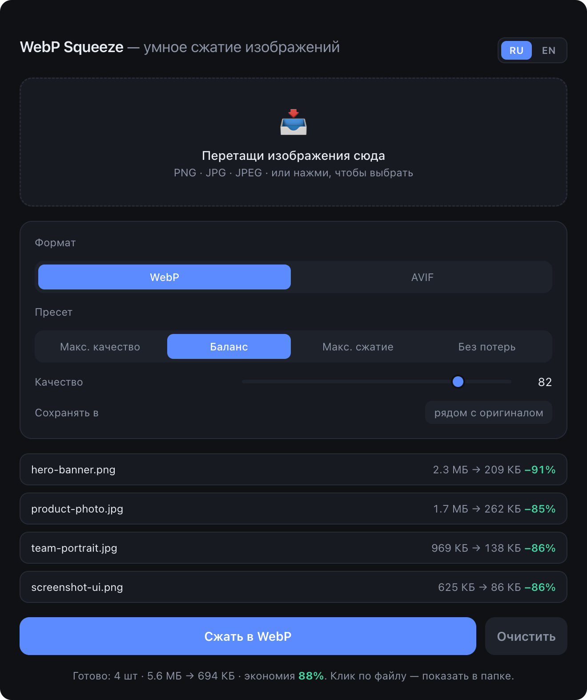

<div align="center">
  
  <h1>WebP Squeeze 🗜️</h1>
  <p><b>Минималистичный офлайн-конвертер изображений в WebP для macOS и Windows.</b><br/>
  Качество сжатия на уровне CloudConvert — тот же кодек <code>libwebp</code>, только локально, бесплатно и без лимитов.</p>

  
  
  

  <p><a href="README.md">English</a> · <b>Русский</b></p>

  
</div>

---

## ✨ Возможности

- **Drag & drop** PNG / JPG / JPEG → **WebP или AVIF** (и TIFF/GIF на вход)
- **Пресеты**: Макс. качество · Баланс · Макс. сжатие · Без потерь + ручной слайдер
- **Батч** — сотни файлов за раз
- Показывает экономию по каждому файлу и суммарно
- Сохраняет рядом с оригиналом или в выбранную папку
- Клик по готовому файлу — открыть в проводнике / Finder
- 100% офлайн: картинки никуда не уходят, работает без интернета
- Локализация интерфейса (русский / английский) — авто по языку системы + переключатель RU/EN в углу
- Уведомление об обновлении — подскажет, когда вышла новая версия, в один клик на скачивание

## 🤔 Зачем это, если есть другие конвертеры?

WebP-инструментов полно — вот честно, где место у этого:

- **vs [Squoosh](https://squoosh.app) (Google):** Squoosh отлично подходит, чтобы вручную покрутить **одну** картинку в браузере. WebP Squeeze сделан под **батч** — закинул десятки файлов, получил все рядом с оригиналами в один клик, полностью офлайн.
- **vs ImageOptim / другие GUI-приложения:** нативное, минималистичное, **кросс-платформенное** (macOS *и* Windows), с пресетами качества и выводом в AVIF.
- **vs `cwebp` / `sharp` в терминале:** тот же движок libwebp и то же качество — но без терминала. Реальное приложение, которым сможет пользоваться даже не-программист из твоей команды.

Это не редактор изображений. Он делает одно: **массовое сжатие в WebP/AVIF без потери качества, локально.** WebP обычно на ~25–35% меньше JPEG и на 60–90% меньше PNG при том же визуальном качестве — AVIF часто ещё меньше.

## 📦 Установка

Скачай готовый установщик со страницы **[Releases](https://github.com/valedol190387/webp-squeeze/releases/latest)**:

| ОС | Файл | Пояснение |
|----|------|-----------|
| **macOS** (Apple Silicon) | `WebP-Squeeze-x.x.x-macOS-arm64.dmg` | Открыть, перетащить в Applications |
| **Windows** — установщик | `WebP-Squeeze-x.x.x-Windows-Installer.exe` | Ставит приложение + создаёт ярлыки (рекомендую) |
| **Windows** — portable | `WebP-Squeeze-x.x.x-Windows-Portable.exe` | Запускается без установки — без прав админа, без ярлыков, можно с флешки |

### macOS — первый запуск
Приложение не подписано сертификатом Apple ($99/год), поэтому macOS попросит подтверждение:
правый клик по иконке → **Открыть** → **Открыть**. Один раз — дальше как обычно.
Если всё равно блокирует:
```bash
xattr -cr "/Applications/WebP Squeeze.app"
```

### Windows — первый запуск
SmartScreen может показать «Windows защитила ваш компьютер» → **Подробнее** → **Выполнить в любом случае** (приложение не подписано EV-сертификатом).

## 🛠 Сборка из исходников

```bash
pnpm install
pnpm run icon      # сгенерировать иконки из assets/icon-source.png (один раз)
pnpm start         # запустить в режиме разработки

pnpm run dist      # собрать под текущую ОС
pnpm run dist:mac  # только macOS (.dmg)
pnpm run dist:win  # только Windows (.exe) — требует Windows
```

> Кросс-сборка Windows на macOS не поддерживается надёжно (нативный модуль `sharp` + NSIS).
> Если форкнешь репозиторий — установщики под обе ОС собираются автоматически:
> запушь тег `vX.Y.Z`, и workflow [`.github/workflows/build.yml`](.github/workflows/build.yml)
> соберёт `.dmg` + `.exe` на раннерах GitHub и приложит их к Release.

## 🧩 Как это работает

- **Electron** — окно и упаковка в нативное приложение
- **sharp** (libvips + libwebp) — движок сжатия, `quality` + `effort: 6` + `smartSubsample` (настройки уровня CloudConvert)

## 📄 Лицензия

[MIT](LICENSE) © Valentin Bryukhantsev
